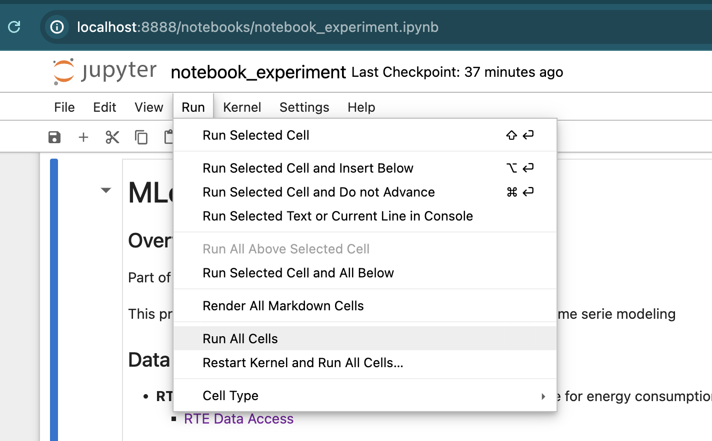
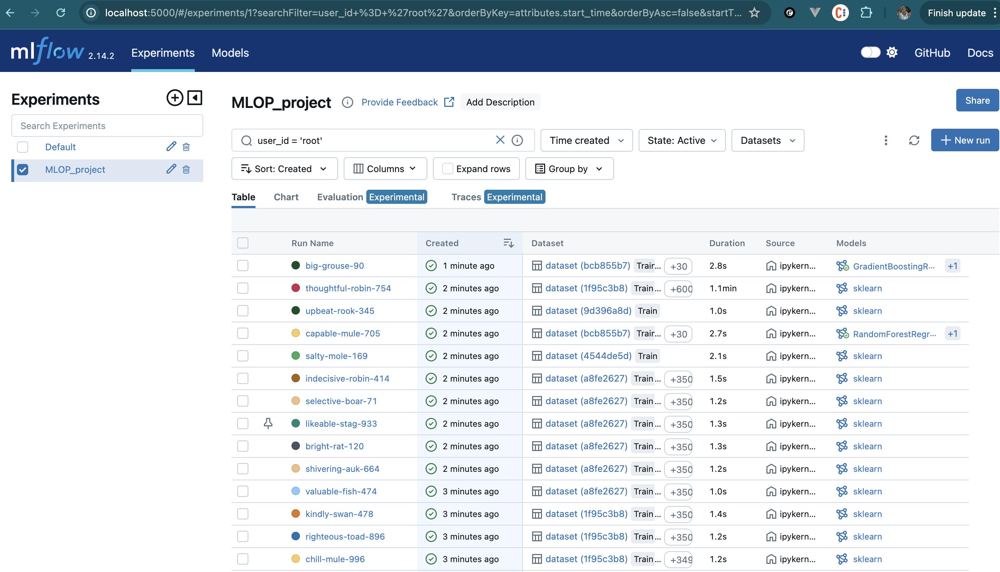
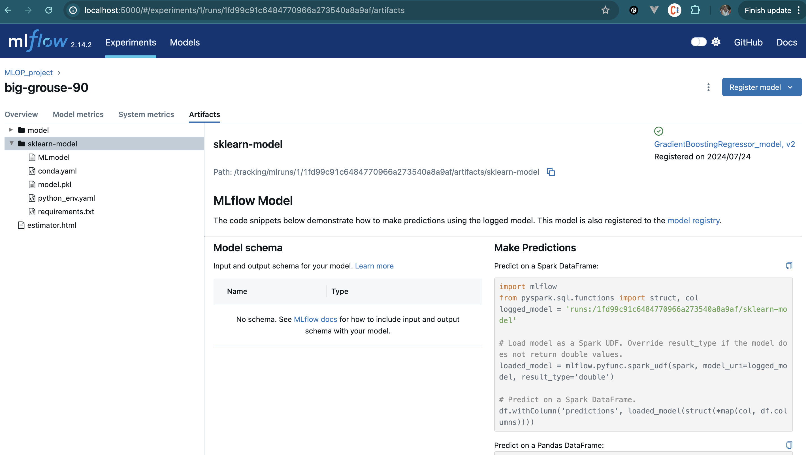
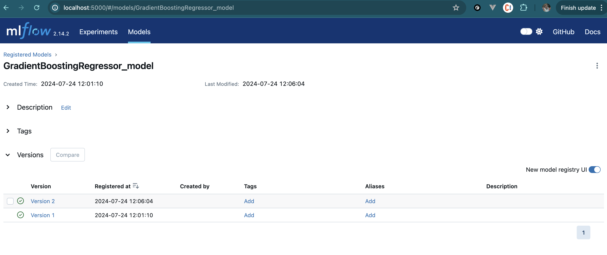

# About Experiment tracking and model registry

## About mflow setup:  

[Experiement Notebook](http://localhost:8888/notebooks/MLOPS_Project.ipynb)
If you explore and run the jupyter notebook you will be able to  find some 
    -  hyperparameter tuning 
    -  experiment tracking 
    -  data version control 
    -  model registry 

The server  mlflow server is available on port http://localhost:5000/

If you want to reproduce the experiments and try model management model registry.You can access the notebook and run it from the docker container. 

http://localhost:8888/notebooks/notebook_experiment.ipynb

Data will  produced  in the container folder mlruns and models,   
the sqlite database. It should be produced locally as well as in the container.

it lasts around 5 minutes to run. 

Ater that  you should see

An overview of all the runs 

you can click on an a specific run  and have an overview of all the parameters 

 as well as  the artifacts log

and finally you can also see the model registered

