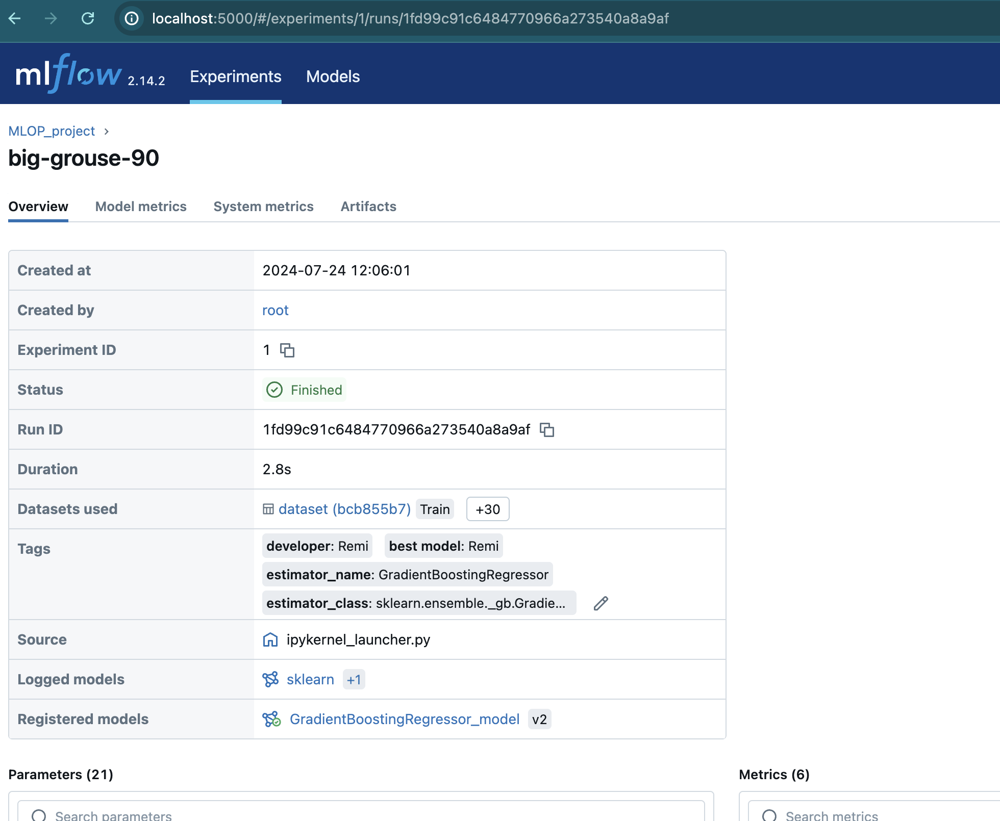

# About Experiment tracking and model registry
On the project, there is  a jupyter server dedicated to  Ml experiments. 
Mlflow is used for tracking and registring models. 

## 1- About Project's experiments: 

On forcasting .... 

[Experiement Notebook](http://localhost:8888/notebooks/notebook_experiment.ipynb) If you explore and run the jupyter notebook you will be able to  find some 
    -  hyperparameter tuning 
    -  experiment tracking 
    -  data version control 
    -  model registry 

If you want to reproduce the experiments and try model management model registry.You can access the notebook and run it from the docker container. 

It will last around 5 minutes to run all the cells, ater that  you should see in mlfow some tracking data

## 2- About  Experiments tracking  & model registering:

The server  mlflow server is available on port http://localhost:5000/

An overview of all the runs 

you can click on an a specific run  and have an overview of all the parameters 

 as well as  the artifacts log

and finally you can also see the model registered

### About Mlflow setup: 

