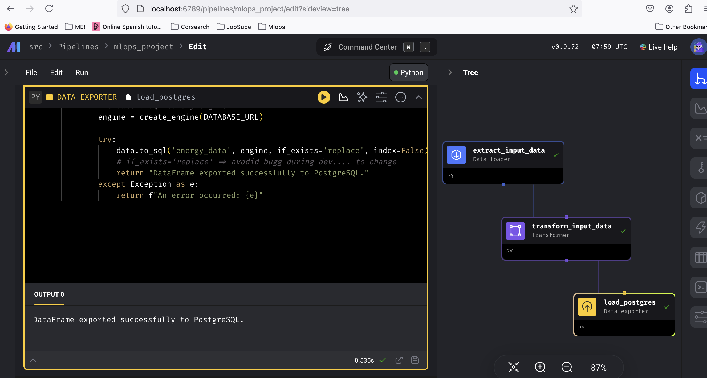
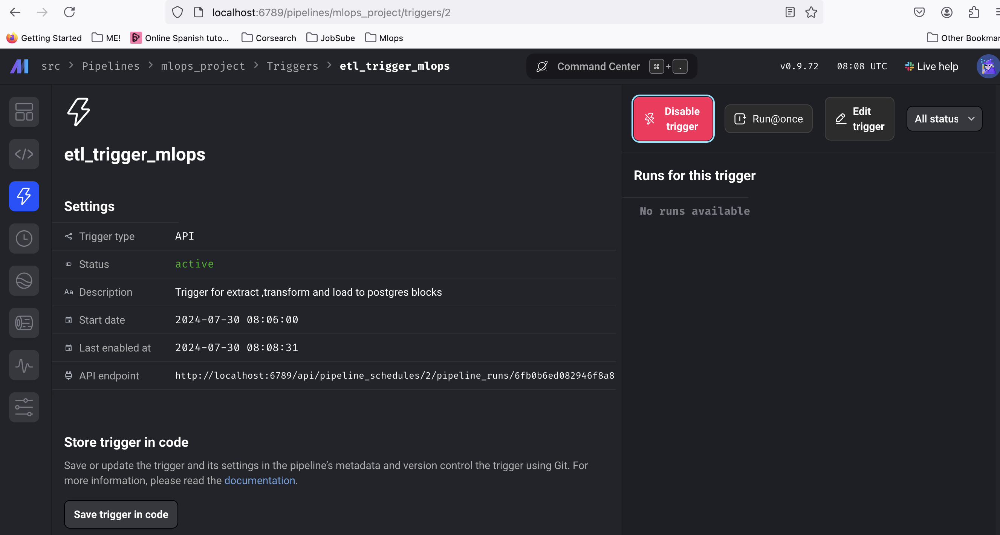

# Pipeline Orchestraction with MAGE AI 

More information about the workflow implementation.Try [Mage on this project](localhost:6789)!!!For some reason it works much better in Firefox...!

1- Trigger manually the pipeline

2- Or do it via API.

It has been also implemntented in the backend level
check:

http://localhost:8000/docs#/default/health_check_mage_trigger_etl_post