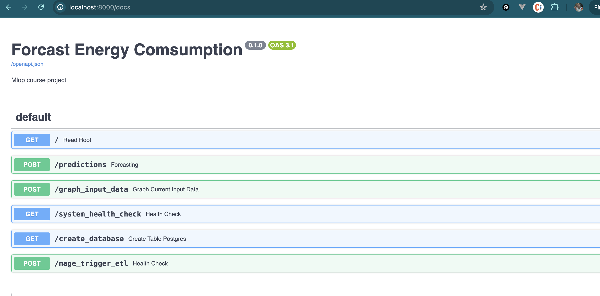
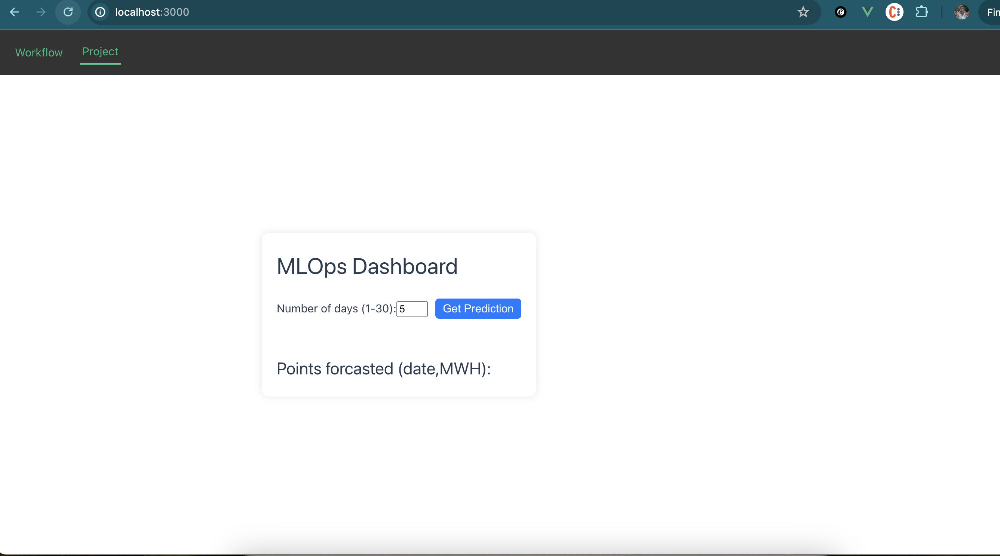
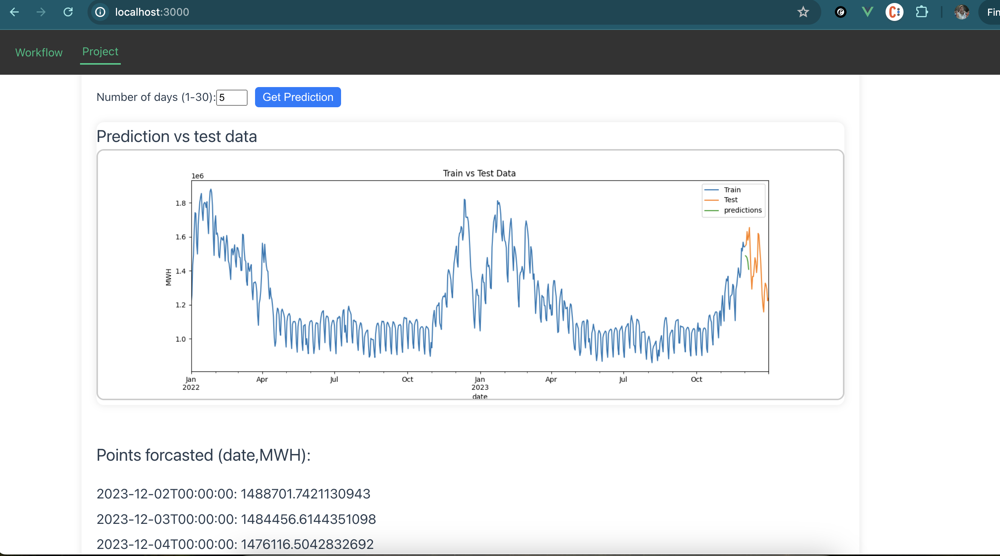
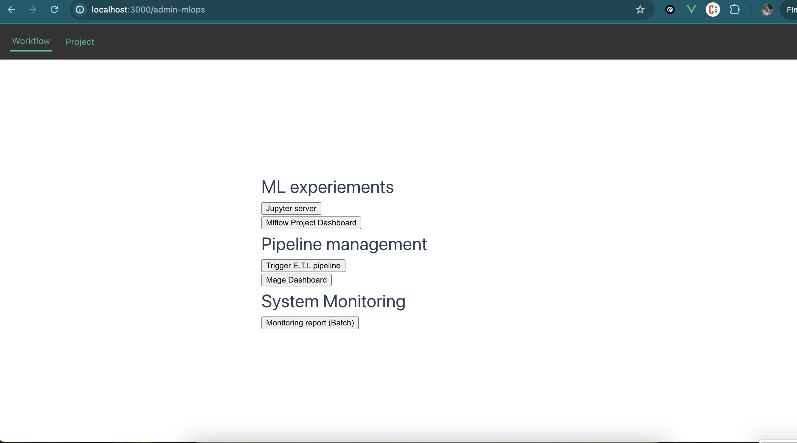

# About DEPLOYMENT 

## BACKEND (Fastapi)
 For the backend FastAPI is used  for serving the model
    - Web server (fastapi)
    - Endpoint to serve the model
    - docs

Enpoints collection:

Endpoint documentation via OpenAPI => [DOCU]("http://localhost:8000/docs")

## FRONTEND (Vuejs)
User Interface => [Vuejs Frontend](http://localhost:3000/)

### Forcast interface

### Frontend response

### Mlops page

