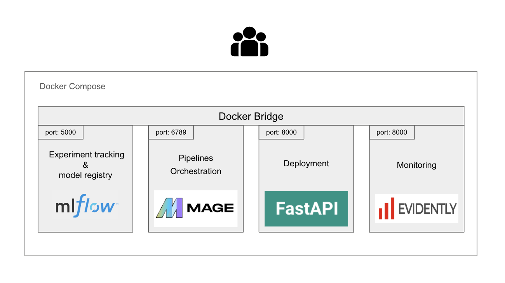

##  Forcast France global energy consumption 

In short, it is a time series forecasting attempt. This utilizes historical daily data on France's energy consumption to forecast the energy consumption days ahead. 
The historical data are coming from RTE,it is  France's Transmission System Operator. To find the data and douvble check the data got their [data portal](https://www.services-rte.com/en/download-data-published-by-rte.html?category=consumption&type=energy_consumption). (you probably need to create an free account...), I saved the data used in a [google drive folder](https://drive.google.com/drive/folders/1-XpTf70thgwDp7z4k2AxOetPem9Mz5ya?usp=sharing) 

The user interface has two parts, one for the foracsting model and one for the management of  model. This last part is intended to MLops. There you can trigger the ETL pipeline, access to Mage and Mlfow dashboard check the monitoring...
 




The project is deplyed at this [ip_adress]("") 


### How to Run the Project Locally:
It is build with docker compose. In each folder, there is a dockerfile and a readme corresponding to a topic of the course.In these readme there are more details about the implementation.
To start the project, you need to have Docker Compose installed, then simply follow these steps below: 

1. Clone the project repository:
   ```bash
   git clone git@gitlab.com:remitoudic/forcast_enery_consumption.git
   ```

2. start the project with docker compose:
    ```bash
    cd to the folder and run:
    docker compose up --build 
    ```

You can check that the project is running properly if
go to http://localhost:8000/system_health_check 


### Mlops Topics:
Mlops practices have been implemented  on this project, for each step  find below a short description and some explication about the implementation: 

- 1  Experient Tracking & model registring:
What does it mean and why is it a key feature in the machine learning ? Experiment tracking and model registration are crucial components in the machine learning workflow. It enables researchers and developers to systematically keep track of their experiments and share results with colleagues efficiently. Tools like MLflow provide a structured and organized way to manage this process.
MLflow is an Open source tool that  allows users to track the models and parameters used during experiments. Additionally, it offers features for registering models and assigning them to different environments. This ensures that the entire machine learning process is transparent, reproducible, and easily shareable.


[More about tracking implemention in the project](1-tracking/README.md)

- 2  Pipeline orchestration available port: What does it mean and why is it also a key feature in the machine learning?  In order to simplfy  process of collecting, transforming and intergrating data, tools like [Mage ai](https://github.com/mage-ai/mage-ai) are used. it allows to schedule sripts and to run easily via interfaces. Mage ai has a good Python / ui inferfacet  as  well a python client. The tool is pretty young and has still some bugs but like  ( at least for me  it doesn't run well on Chrome but run smoothly on  Firefoxe)

[More about Pipeline orchestration implemention in the project](2-orchestration/README.md)

   
- 3 Deployment:
 
 The deployement  part is the heart of this  project becaause it is  what allows connectiviting beteween all the pieces. It includes a backend  which communinicate with Mlflow, Mage and the monitoring and server  most of it.  
 It also includes a frontend sever for  the user interface. 

 [More about  the deployment implemention in the project](3-deployment/README.md)

- 4 Monitoring:
    - Service
    - Evidently AI


- 5 DevOps practices:
    - Continous Intergation has been done with Github Action.
    - Code quality:
        - Linter: flake 8
        - format: ruff
    - Cloud usage: the project is deploy on GCP.
    - Testing / test coverage : Pytest


