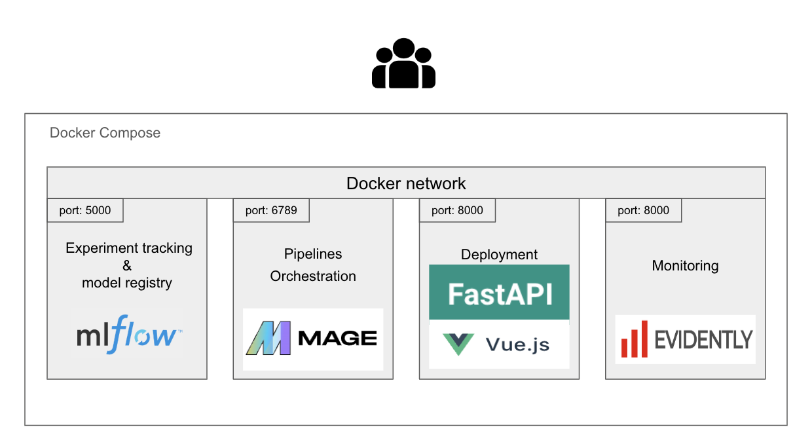

##  Forcast France global energie consumption 

### About the Project:
This project utilizes historical daily data on France's energy consumption to forecast the energy consumption for  a week ahead  from the data . It is essentially a time series forecasting attempt.

The historical data are coming from RTE,it is  France's Transmission System Operator. To find the data and douvble check the data got their [data portal](https://www.services-rte.com/en/download-data-published-by-rte.html?category=consumption&type=energy_consumption). (you probably need to create an free account...), I saved the data used in a [google drive folder](https://drive.google.com/drive/folders/1-XpTf70thgwDp7z4k2AxOetPem9Mz5ya?usp=sharing) 


The project is build with docker compose. In each folder, there is a dockerfile and a readme corresponding to a topic of the course.In these readme there are more details about the implementation.
 
Overview of the project 




### How to Run the Project Locally:
First let's see how to start this project locally. you need to have Docker Compose installed, then follow these steps below: 

1. Clone the project repository:
   ```bash
   git clone git@gitlab.com:remitoudic/forcast_enery_consumption.git
   ```

2. start the project with docker compose:
    ```bash
    cd to the folder and run:
    docker compose up --build 
    ```

After that  the project you be running. 
go to http://localhost:8000/system_health_check


### Mlops Topics:
All the main step, in terms Mlops practices have been implemented  on this project. 
For each step  find below a short description and some explication about the implementation: 

- 1  Experient Tracking & model registring:
What does it mean and why is it a key feature in the machine learning ? Experiment tracking and model registration are crucial components in the machine learning workflow. It enables researchers and developers to systematically keep track of their experiments and share results with colleagues efficiently. Tools like MLflow provide a structured and organized way to manage this process.
MLflow is an Open source tool that  allows users to track the models and parameters used during experiments. Additionally, it offers features for registering models and assigning them to different environments. This ensures that the entire machine learning process is transparent, reproducible, and easily shareable.
On the project Mlflow is for tracking registring models. 

[More about tracking implemention in the project](1-tracking/README.md)

- 2  Pipeline orchestration available port:  In order to simplfy  process to collect, transform and intergrate data  tools like mage ai are used. it allow schedule sript to run easily via   user interface. it has a good Python / ui inferfacet  as  well a python client.
    - web interface: http://localhost:6789/

[More about Pipeline orchestration implemention in the project](2-orchestration/README.md)
- 3 Deployment (available port: 8000):
FastAPI is used  for serving the model 
    -  Docker
    -  web server (fastapi)
    - Endpoint to serve the model 

- 4 Monitoring:
    - Service
    - Evidently AI

- Best practices
    -  unit tetsing
    -  integration testing  
    -  pylint
    -  CI 


